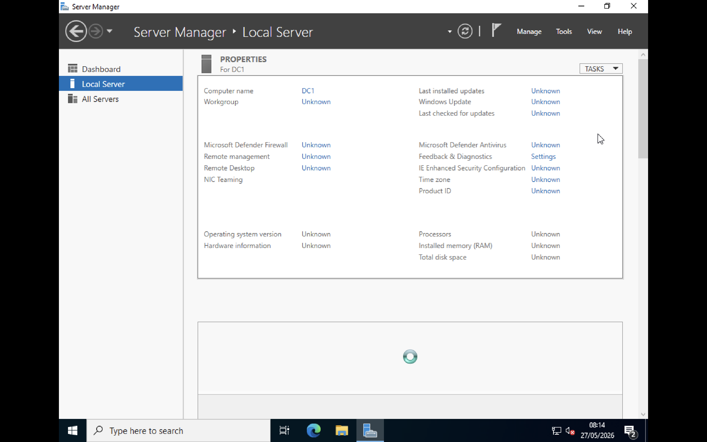
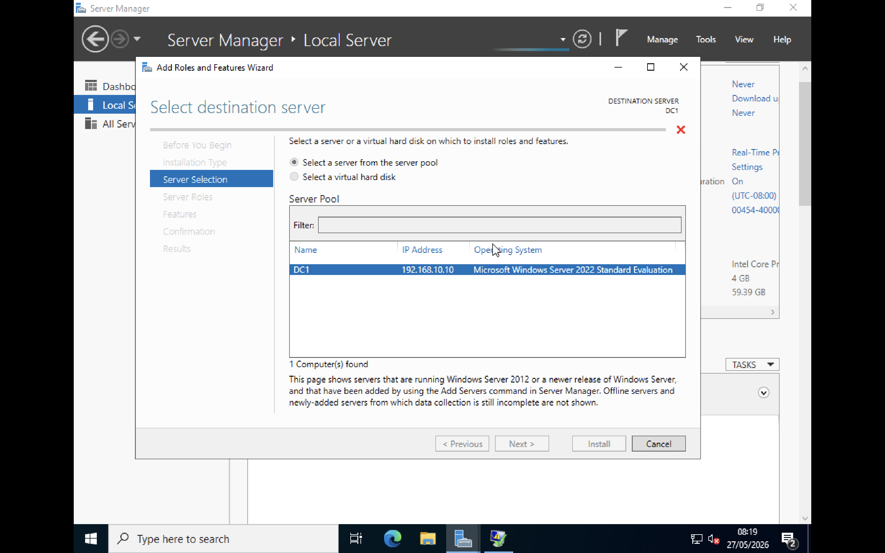
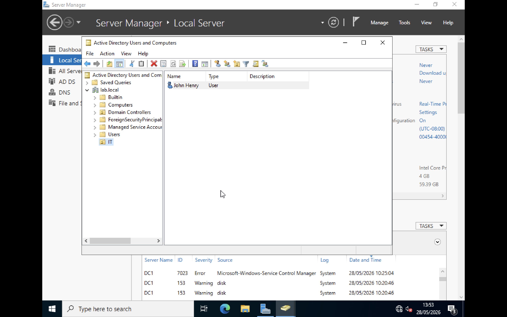

# Active Directory Home Lab

 ## Overview
Built a home lab using Windows Server on UTM (macOS) to learn Active Directory, DNS, and Windows Server administration.

## Tools Used
- MacBook (host machine)
- UTM virtualisation software
- Windows Server (Desktop Experience)
- Active Directory Domain Services (AD DS)
- DNS Server

## Virtual Machine Setup
Initial VM setup and configuration in UTM.

## Active Directory Installation & Configuration
Installed AD DS and DNS roles and configured the server as a Domain Controller (DC1).

## User Creation in Active Directory
Created a domain user account named John Henry in Active Directory Users and Computers.

## Troubleshooting & Problem Resolution

### 1. VM Boot Issue (EFI Shell Loop)
**Problem:** 
The virtual machine booted into EFI shell instead of Windows Server installer.

**Cause:**  
Incorrect VM architecture selection (ARM instead of x86_64).

**Fix:**  
Recreated the VM using the correct Intel x86_64 configuration and attached the Windows Server ISO properly.

### 2. Active Directory Requires Static IP
**Problem:**  
Active Directory installation requires a stable network configuration.

**Fix:**  
Configured static IPv4 settings:
- IP: 192.168.10.10
- DNS: 127.0.0.1

### 3. DNS Dependency for Domain Setup
**Problem:**  
Domain setup requires DNS to resolve correctly.

**Fix:**  
Installed and configured DNS role on the Domain Controller and ensured the server points to itself for DNS resolution.

## Summary
Successfully deployed a Windows Server Active Directory environment in a virtual lab using UTM on macOS.

The environment includes:
Active Directory Domain Services (AD DS)
DNS configuration
Domain Controller setup (DC1)
Organizational Unit (OU) creation
Domain user management

This project demonstrates foundational Windows Server administration, identity management, and basic enterprise network configuration.
